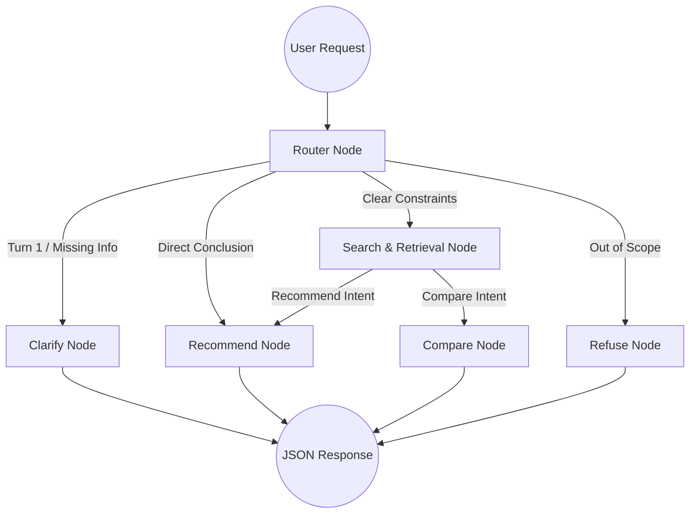

# SHL Intelligence Console

An advanced conversational AI agent that helps recruiters find the right SHL assessments through natural dialogue. Rather than relying on rigid keyword searches, recruiters describe their hiring needs in plain language, and the agent intelligently clarifies requirements, performs semantic retrieval over the SHL catalog, and recommends a grounded shortlist of assessments.

## 🧠 Architecture Overview

The backend is built on a **stateless LangGraph architecture**, enforcing a robust, predictable multi-turn agentic workflow. The frontend completely owns the conversation state and passes the full message history on every request, preventing backend persistence leaks and removing the need for state checkpointers.

### Agent Workflow



## 🛠 Tech Stack

**Intelligence & Backend:**
- **FastAPI**: Asynchronous API server.
- **LangGraph**: State machine orchestrating the agent's cognitive phases.
- **Groq (LLaMa-3 70b)**: High-speed LLM inference for routing, contextual reasoning, and structured data extraction.
- **FAISS & SentenceTransformers**: Local semantic vector store (`all-MiniLM-L6-v2`) for instant, low-latency catalog retrieval.

**Frontend UI:**
- **React 18 & TypeScript** (Scaffolded with Vite)
- **Vanilla CSS Modules**: Custom design tokens ensuring a premium, unified aesthetic (Deep Ink Navy, Warm Paper, Verified Green) avoiding generic utility-class templates.
- **Custom `useChat` Hook**: Direct API contract enforcement, handling streaming limits, strict 8-turn caps, and state persistence.

## ⚙️ Core Behaviors & Safeguards

- **Strict Turn-1 Clarification**: The agent is hard-coded to *never* assume perfect knowledge on the first turn. It dynamically analyzes the conversation and isolates the single most critical missing variable (e.g., technical vs behavioral measurement).
- **Zero-Hallucination Recommendation**: Recommendations are strictly grounded in retrieved FAISS context. The `recommend_node` is structurally forced to return empty lists if no valid catalog entries are retrieved, completely eliminating AI hallucinations.
- **Refusal Boundary**: Out-of-scope inquiries (legal advice, HIPAA compliance, prompt injections) are intercepted by the Router and routed to a dedicated refusal node.
- **Automated Evaluation Harness**: Includes `evaluate.py` for testing Schema Compliance, Recall@10, and Hallucination metrics against simulated conversation traces.

## 🚀 Getting Started

### Prerequisites
- Python 3.10+
- Node.js 18+
- Groq API Key

### 1. Backend Setup
```bash
# Clone the repository
git clone https://github.com/shubhamgupta407/SHL-Intelligence-Console.git
cd SHL-Intelligence-Console

# Create and activate virtual environment
python3 -m venv .venv
source .venv/bin/activate

# Install dependencies
pip install -r requirements.txt

# Configure Environment (Add your Groq API key)
echo "GROQ_API_KEY=your_key_here" > .env

# Start the FastAPI server
uvicorn main:app --port 8000 --reload
```

### 2. Frontend Setup
```bash
# Open a new terminal and navigate to frontend directory
cd frontend

# Install dependencies
npm install

# Start the development server
npm run dev
```

The application will automatically start on `http://localhost:5173`.

---
*Architected and developed as a technical evaluation for AI Research.*
