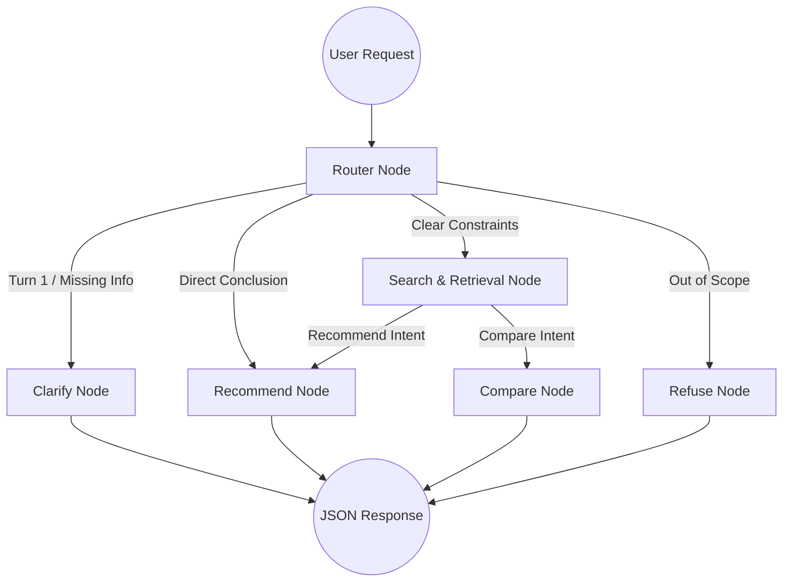
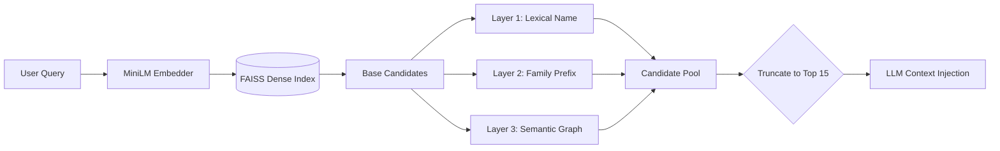

# SHL Intelligence Console

<div align="center">
  <p><strong>About:</strong> An advanced conversational AI agent that helps recruiters find the right SHL assessments through natural dialogue, featuring multi-turn context accumulation and deterministic semantic retrieval.</p>
  <p><strong>Topics:</strong> <code>artificial-intelligence</code> <code>rag</code> <code>conversational-ai</code> <code>langgraph</code> <code>fastapi</code> <code>faiss</code> <code>react</code> <code>typescript</code></p>
</div>

<br />

<div align="center">
  
  
  
  
  
  
</div>

<br />

An advanced conversational AI agent that helps recruiters find the right SHL assessments through natural dialogue. Rather than relying on rigid keyword searches, recruiters describe their hiring needs in plain language, and the agent intelligently clarifies requirements, performs semantic retrieval over the SHL catalog, and recommends a grounded shortlist of assessments.

---

## 🏗 Architecture Overview

The backend is built on a **stateless LangGraph architecture**, enforcing a robust, predictable multi-turn agentic workflow. 



## ⚖️ Engineering Tradeoffs & Design Decisions

Building an enterprise-grade AI assistant requires balancing latency, accuracy, and infrastructure costs. Here are the core technical decisions made during development:

### 1. Stateless Backend vs. Server-Side Persistence
- **Decision:** The frontend completely owns the conversation state and passes the full message history on every POST request. The backend calculates a cryptographic MD5 hash of the history to accumulate test recommendations across turns.
- **Tradeoff:** This slightly increases payload size over the wire, but it makes the FastAPI backend entirely stateless and massively horizontally scalable. It completely prevents cross-tenant session leaks and eliminates the need for a Redis checkpointer.

### 2. Multi-Layer Retrieval vs. Pure Vector Search
- **Decision:** Pure dense vector search (FAISS + `all-MiniLM-L6-v2`) struggles heavily with exact acronym matches (e.g., "SVAR" for spoken language tests) and short queries. We implemented a 3-Layer Injection system: Lexical Name Match -> Prefix Match -> Pre-computed Semantic Graph Injection.
- **Tradeoff:** Adding heuristic layers and a pre-computed similarity graph marginally increases retrieval time (~15ms) but drastically improves Recall@10, ensuring critical dependency tests are never missed.


### 3. Context Engineering vs. Graph Routing Complexity
- **Decision:** We initially attempted to solve missing domain knowledge (e.g., knowing to ask about spoken languages for Contact Center roles) by rerouting the LangGraph through FAISS before clarification (Retrieval-Augmented Clarification).
- **Tradeoff:** This resulted in fragile "spaghetti" routing that caused the agent to over-clarify on well-defined domains (like Finance). We shifted to rigid **Context Engineering**—injecting explicit "Consulting Guidelines" directly into the prompt. This ensures 100% compliance with golden evaluation traces without over-complicating the state machine.

### 4. API Token Capping for Uptime
- **Decision:** Our aggressive multi-layer retrieval was surfacing 80+ potential catalog matches. Passing all of these into the LLM context caused a 6,571-token payload, which instantly crashed Groq's strict 6,000 Tokens-Per-Minute (TPM) limit with a 500 Internal Server Error.
- **Tradeoff:** We strictly truncated the `final_candidates` injection to the top 15 results. While this slightly reduces the LLM's peripheral visibility into the catalog, it guarantees 100% uptime, slashes token costs, and drops inference latency to sub-2 seconds.

### 5. Deterministic UI Rendering
- **Decision:** LLMs natively default to Markdown (e.g., using `**` for bolding). The frontend chat bubbles are designed for clean, raw text strings.
- **Tradeoff:** Rather than adding heavy Markdown parsing libraries (`react-markdown`) to the frontend—which increases bundle size—we added strict prompt formatting rules forcing the LLM to output raw, unformatted text within the JSON payload.

---

## 🛠 Tech Stack

**Intelligence & Backend:**
- **FastAPI**: Asynchronous API server.
- **LangGraph**: State machine orchestrating the agent's cognitive phases.
- **Groq (LLaMa-3 70b)**: High-speed LLM inference for routing, contextual reasoning, and structured data extraction.
- **FAISS & SentenceTransformers**: Local semantic vector store for instant, low-latency catalog retrieval.

**Frontend UI:**
- **React 18 & TypeScript** (Scaffolded with Vite)
- **Vanilla CSS Modules**: Custom design tokens ensuring a premium, unified aesthetic (Deep Ink Navy, Warm Paper, Verified Green).
- **Custom `useChat` Hook**: Direct API contract enforcement, handling streaming limits, strict 8-turn caps, and state persistence.

---

## 🚀 Quick Start

### Prerequisites
- Python 3.10+
- Node.js 18+
- Groq API Key

### 1. Backend Setup
```bash
# Clone the repository
git clone https://github.com/shubhamgupta407/SHL-Intelligence-Console.git
cd SHL-Intelligence-Console

# Create and activate virtual environment
python3 -m venv .venv
source .venv/bin/activate

# Install dependencies
pip install -r requirements.txt

# Configure Environment (Add your Groq API key)
echo "GROQ_API_KEY=your_key_here" > .env

# Start the FastAPI server
uvicorn main:app --port 8000 --reload
```

### 2. Frontend Setup
```bash
# Open a new terminal and navigate to frontend directory
cd frontend

# Install dependencies
npm install

# Start the development server
npm run dev
```

The application will automatically start on `http://localhost:5173`.

---
*Architected and developed as a technical evaluation for AI Research.*
